# Talk2DAU Chatbot

A conversational AI chatbot powered by Langchain and Groq LLM, designed to answer questions based on uploaded PDF documents. Built with Streamlit for an interactive web app experience.

---

## Tech Stack

[](https://www.python.org/)
[](https://streamlit.io/)] 
[](https://www.langchain.com/)
[](https://groq.com/)
[](https://github.com/facebookresearch/faiss)
[](https://huggingface.co/docs/transformers/index)
[](https://api.python.langchain.com/en/latest/loaders/langchain_community.document_loaders.pypdf_directory.PyPDFDirectoryLoader.html)
[](https://pypi.org/project/python-dotenv/)
[](https://docs.streamlit.io/streamlit-cloud/secrets-management)
[](https://git-scm.com/)
[](https://github.com/)

- **Python** — Main programming language  
- **Streamlit** — Web app framework for interactive UI  
- **Langchain** — Framework for building LLM-powered apps  
- **Groq LLM (ChatGroq)** — Large Language Model API for answering queries  
- **FAISS** — Vector similarity search library for document retrieval  
- **HuggingFace Embeddings** — To generate embeddings for documents  
- **PyPDFDirectoryLoader** — Load and parse PDFs from a folder  
- **dotenv** — Load environment variables locally  
- **Streamlit Secrets** — Secure storage of API keys in deployment  
- **Git & GitHub** — Version control and code hosting


---

## Features

- Upload and process multiple PDF documents.
- Split documents into chunks for better retrieval.
- Use vector embeddings with FAISS for fast document similarity search.
- Query the chatbot with natural language questions.
- Answers generated by Groq LLM based on the context of documents.
- Display relevant document chunks as references.
- Easy deployment using Streamlit Cloud.
- Secure management of API keys via Streamlit Secrets.




## Getting Started

### Prerequisites

- Python 3.8 or higher
- Git

### Installation

1. Clone the repo:

   ```bash
   git clone https://github.com/NT1906/Talk2DAU.git
   cd Talk2DAU
   ```

2. Create and activate a virtual environment (recommended):

   ```bash
   python -m venv venv
   source venv/bin/activate  # On Windows: venv\Scripts\activate
   ```

3. Install dependencies:

   ```bash
   pip install -r requirements.txt
   ```

4. Set up API keys securely:

   - Locally, create `.streamlit/secrets.toml` with your keys:

     ```toml
     GROQ_API_KEY = "your_groq_api_key_here"
     LANGSMITH_API_KEY = "your_langsmith_api_key_here"
     ```

   - On Streamlit Community Cloud, add these keys via the app dashboard under **Secrets**.

5. Prepare your PDFs:

   - Add your PDF files into the `files/` directory.

---

## Usage

Run the app locally:

```bash
streamlit run app.py
```

- Click **Start Bot** to process PDFs and create embeddings.
- Enter your questions in the input box.
- Get answers along with relevant document chunks displayed.


## Notes

- This bot is **not affiliated with Dhirubhai Ambani University**.
- Misinformation may be generated — always verify answers independently.

